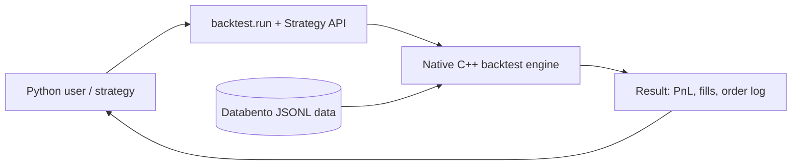
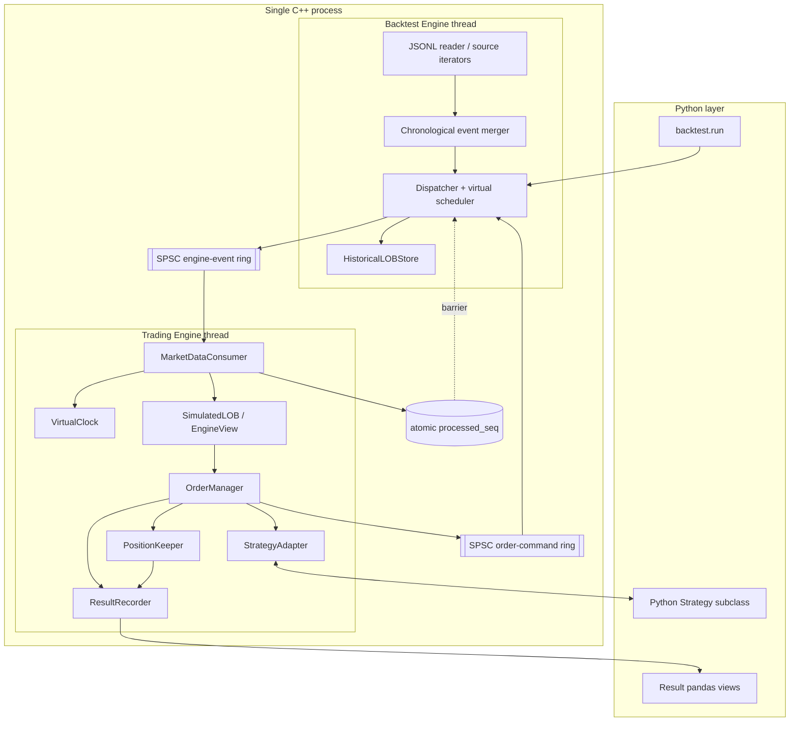
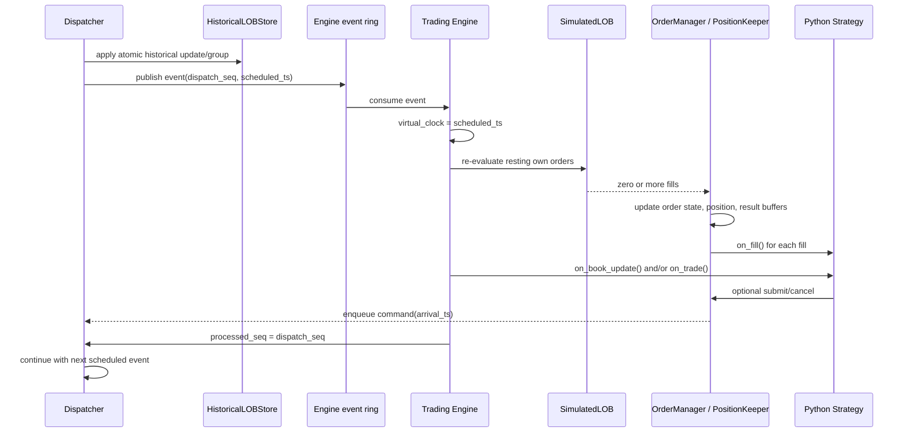
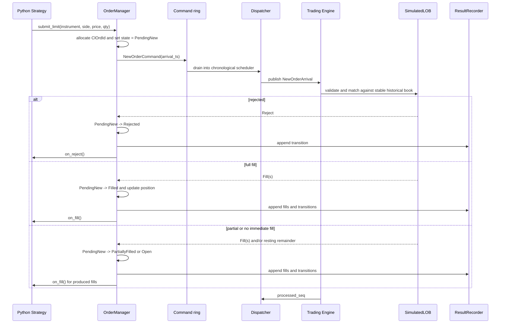

# Context, containers, and runtime shape

## 1. System context

## 2. Process and thread model

## 3. Why two threads

The assignment explicitly distinguishes a backtest engine thread and trading engine thread and requires an atomic ready sequence. The two-thread design demonstrates the intended synchronization while staying small enough for a course project.

- The Backtest Engine owns chronological scheduling and writes the shared historical book.
- The Trading Engine consumes one published event at a time, matches private orders, updates state, and invokes Python.
- The strict barrier means the shared book is stable while the Trading Engine reacts to the current event.

## 4. Strategy location

The strategy implementation is Python-side. C++ defines a Strategy interface/trampoline and calls the Python override from the Trading Engine thread. The “Strategy Logic” box in the source diagram is therefore the runtime callback location, not a requirement to implement strategies in C++.

## 5. Market-event sequence

## 6. Order-arrival sequence

## 7. Runtime ownership summary

| State | Sole writer | Readers |
|---|---|---|
| Historical market book | Backtest Engine thread | Trading Engine while dispatcher waits |
| Scheduler heap / command ordering | Backtest Engine thread | none |
| EngineView private overlay | Trading Engine thread | strategy queries on same thread |
| OrderManager / PositionKeeper | Trading Engine thread | strategy callbacks on same thread |
| Result buffers | Trading Engine thread during run | Python after threads join |
| Python strategy object | Python caller owns lifetime; Trading Engine invokes | Python caller after run |

Avoiding multi-writer state is more valuable here than introducing general-purpose locking.
