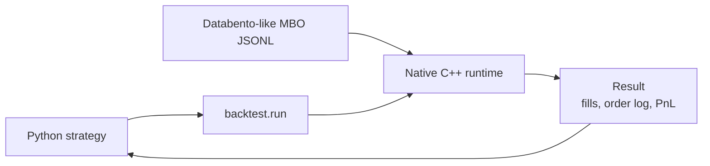
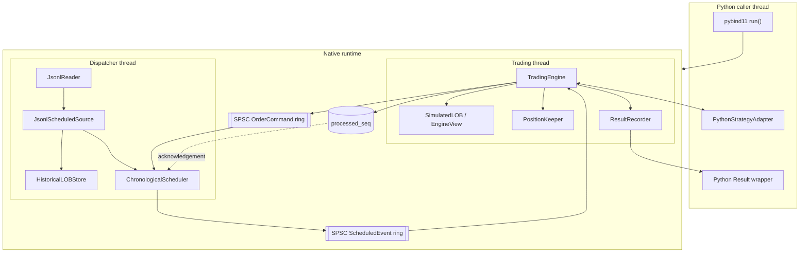
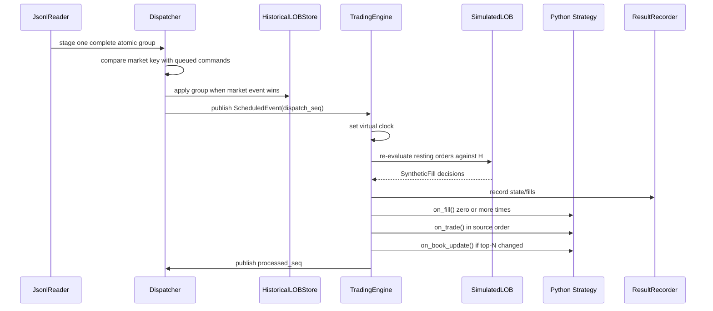
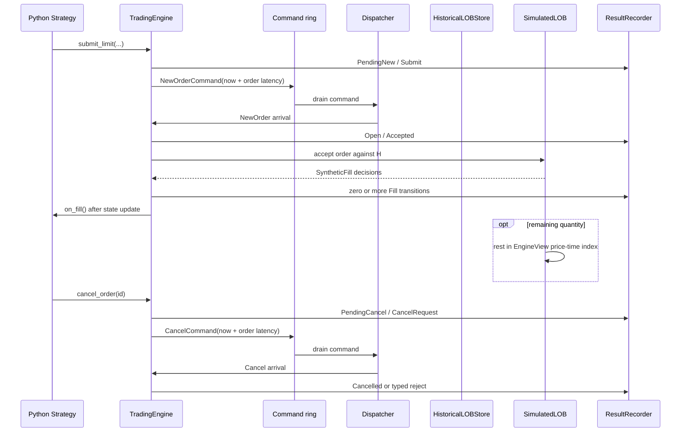

# Runtime architecture and data flow

## System context

`backtest.run()` is the public entry point. It accepts a Strategy instance,
input path, date range, optional configuration, and optional instrument
metadata. When metadata is omitted, the binding performs one discovery pass to
find numeric instrument IDs and then runs the streaming replay with Databento
nanounit price scaling.

## Process and thread model

`SchedulerRuntime::run()` starts and joins both native threads. The Python
binding releases the GIL around the native run. The trading thread reacquires
the GIL only while calling a Python strategy method.

## Ownership

| State | Writer | Read access |
|---|---|---|
| JSONL reader and staged atomic group | Dispatcher thread | Dispatcher only |
| `HistoricalLOBStore` | Dispatcher thread | Trading thread while dispatcher waits for acknowledgement |
| Scheduler heap and source merge state | Dispatcher thread | Dispatcher only |
| Event ring | Dispatcher producer | Trading consumer |
| Command ring | Trading producer | Dispatcher consumer |
| Virtual clock and private orders | Trading thread | Strategy during an active callback |
| Positions and private resting orders | Trading thread | Strategy during an active callback |
| Mutable result recorder | Trading thread | Runtime marking code executes in the same consumer callback |
| Frozen result storage | No writers after `freeze()` | Python arrays/DataFrames |
| Python Strategy object | Python owns lifetime | Trading thread invokes it while holding the GIL |

Single-writer ownership and the ready barrier avoid hot-path book mutexes in the
mandatory runtime.

## Market-delivery flow

The source stages a group before chronological selection but delays historical
book mutation until `prepare_for_dispatch()`. A strategy command scheduled
before that market group therefore observes the old book. Equal-time market
data still wins because market priority is lower numerically.

## Order and cancel flow

Commands submitted by a callback are fully enqueued before the current event
is acknowledged. The dispatcher drains them while waiting and merges them with
future market deliveries.

## End of run

At normal end-of-data, commands at or before the inclusive range end are
processed, rings are closed, threads join, and `ResultRecorder::freeze()`
produces immutable shared storage. On failure, the first exception triggers the
same wake-and-join path and is rethrown after both threads exit.
