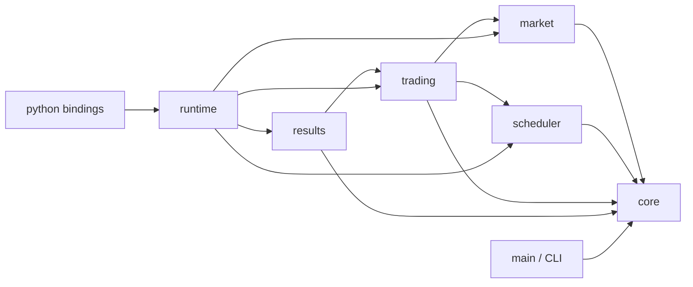
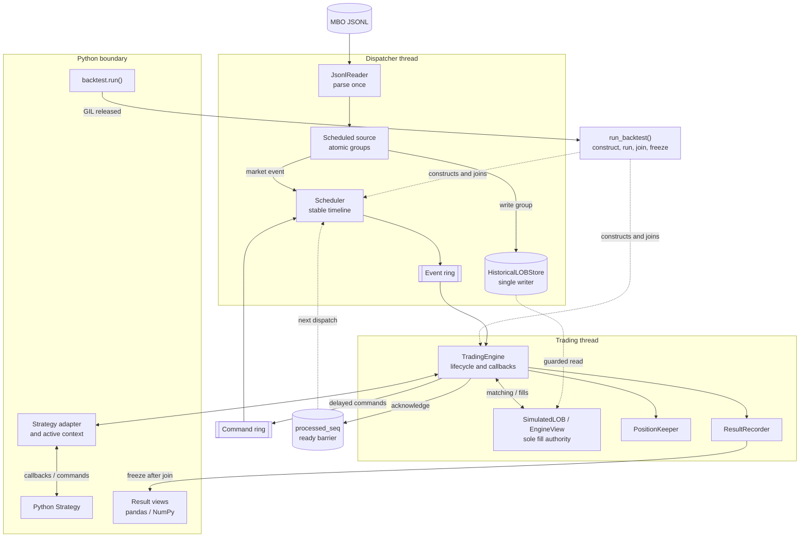

# Components, source tree, and boundaries

## Dependency direction



The build currently compiles native implementation files into the static
library `back-tester-lib`. Folder boundaries still define ownership even though
they are not separate libraries.

## Runtime component interaction



The diagram is arranged as three layers: Python boundary, dispatcher thread,
and trading thread. Solid arrows show runtime data or control flow; dotted
arrows show lifetime, synchronization, or guarded read relationships. The
dispatcher is the only writer of `HistoricalLOBStore`. The trading thread is
the only writer of private order state, positions, and mutable result columns.
The ready barrier keeps the guarded historical-book read stable through
matching, state updates, callbacks, and command publication.

The sequence diagrams in
[`02_context_and_containers.md`](02_context_and_containers.md) define the exact
ordering within the market-delivery and order/cancel paths.

## Implemented source layout

```text
src/
  core/        dependency-free public contracts
  market/      typed JSONL ingestion and historical L3 books
  scheduler/   event ordering, SPSC queues, ready barrier, thread runtime
  trading/     private orders, matching, callbacks, positions
  results/     columnar result storage and PnL
  runtime/     end-to-end source/scheduler/engine composition
  python/      pybind11 API and pandas/NumPy hand-off
  common/      compatibility include for legacy BasicTypes users
  main/        CLI plus earlier standalone LOB compatibility code
python/
  back_tester/ public import package
  tests/       Python integration and end-to-end tests
  benchmarks/  Python callback benchmark
test/          native unit/integration tests and fixtures
examples/      runnable Python strategy
```

## Component responsibilities

### `src/core`

Defines the shared numeric and enum types, configuration, scheduled payloads,
callback views, query rows, and result row schemas:

- [`Types.hpp`](../../../src/core/Types.hpp)
- [`BacktestConfig.hpp`](../../../src/core/BacktestConfig.hpp)
- [`Events.hpp`](../../../src/core/Events.hpp)
- [`ResultSchemas.hpp`](../../../src/core/ResultSchemas.hpp)
- [`Contracts.hpp`](../../../src/core/Contracts.hpp)

This layer contains no JSON, book containers, Python objects, scheduler queues,
or matching logic.

### `src/market`

Owns input parsing and shared historical state:

- `JsonlReader` streams and validates physical JSONL rows.
- `Parsing` converts timestamps and decimal prices once into native integers.
- `LimitOrderBook` reconstructs per-instrument L3 state and exposes ordered
  historical slices and top-N aggregated levels.
- `HistoricalLOBStore` routes events to one book per instrument.

Malformed rows, unsupported values, source chronology regression, and corrupt
L3 actions raise typed errors. The reader does not load or sort the full replay.

### `src/scheduler`

Owns deterministic time ordering and thread synchronization:

- `ChronologicalScheduler` is the bounded pending-command heap.
- `SchedulerRuntime` merges one prefetched market group with delayed commands,
  starts the dispatcher and consumer threads, and propagates failures.
- `SpscRing` carries events and commands with documented acquire/release
  publication.
- `ReadyBarrier` carries the atomic processed sequence.

The scheduler does not parse JSON, calculate fills, call Python, or own
strategy state.

### `src/trading`

Owns strategy-visible mutable state:

- `TradingEngine` implements `StrategyContext`, command submission, lifecycle
  transitions, position/result application, and callback order.
- `SimulatedLOB` is the sole synthetic-fill authority; its `EngineView` owns
  private consumption and price-time resting indexes.
- `PositionKeeper` maintains signed quantity and FIFO realized-PnL inputs.
- `Strategy` and `Recorder` are narrow native callback interfaces.

The trading module reads but never mutates `HistoricalLOBStore`.

### `src/results`

`ResultRecorder` appends typed fill/order/PnL columns, maintains exact
multiplier-scaled accounting, coalesces equal-time PnL samples, and freezes its
buffers into reference-counted immutable `FrozenResults`.

It creates no pandas or Python objects in the native event loop.

### `src/runtime`

`run_backtest()` validates configuration and instrument metadata, constructs
the books, recorder, trading engine, streaming scheduled source, and scheduler,
then freezes results after the threads join.

`discover_databento_instruments()` is the optional metadata discovery pass used
by the minimal three-argument Python API.

### `src/python`

The `_backtester` pybind11 module:

- binds public enums, configuration, callback payloads, query rows, and Result;
- adapts Python Strategy methods to the native `Strategy` interface;
- activates the Strategy context only during a callback;
- releases the GIL for the native run and reacquires it per callback;
- exposes frozen native columns through NumPy-backed pandas objects.

The pure-Python package `python/back_tester/__init__.py` re-exports the module
and supplies the documented `backtest.run` namespace.

### `src/main` and `src/common`

`src/main` provides the `back-tester` ingestion CLI and retains compatibility
LOB code used by legacy focused tests. It is not the implementation behind
Python `backtest.run()`. `src/common/BasicTypes.hpp` is a compatibility include
over the core contracts.

## Build targets

| Target | Purpose |
|---|---|
| `back-tester-lib` | Native static library containing engine modules |
| `back-tester` | CLI ingestion smoke executable |
| `_backtester` | pybind11 extension installed as `back_tester._backtester` |
| `back-tester-tests` | Native test executable registered with CTest |
| `back-tester-scheduler-benchmark` | Release ready-signal benchmark |

The extension is enabled by `BUILD_PYTHON_MODULE=ON`; scikit-build-core sets
that option for editable and wheel builds.

## Boundary rules

- Parse strings and decimals only in `market` or the Python boundary.
- Keep prices, timestamps, quantities, IDs, states, and sequences numeric in
  the event and matching paths.
- Only the dispatcher writes the historical book.
- Only the trading thread writes private orders and positions.
- Only `SimulatedLOB` creates synthetic fills; `TradingEngine` applies them.
- Only `ResultRecorder` owns mutable result buffers.
- Python callback payloads are immutable values; callback-scoped native spans
  are copied before exposure to Python.
