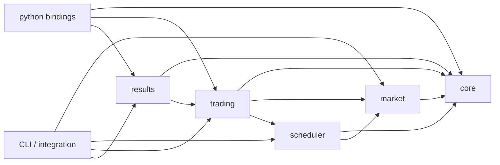

# Components, ownership, and dependencies

## 1. Dependency direction



Rules:

- `core` depends on no project module.
- `market` must not depend on Python, pandas, Strategy, or OrderManager.
- `scheduler` owns ordering and synchronization, not matching rules.
- `trading` owns private state and matching, not JSON parsing.
- `results` records already-decided events; it does not decide fills.
- `python` is a boundary adapter, not the home of engine semantics.

## 2. Component responsibilities

### `core`

Owns:

- fixed-width type aliases;
- enums for side, order state, command/event type, reject reason;
- `InstrumentMeta` and `BacktestConfig`;
- immutable message/view structs;
- lightweight error types.

Must not own JSON, book containers, scheduler queues, pandas, or Python objects.

### `market`

Owns:

- JSONL parsing and validation;
- decimal-price-to-ticks and timestamp-to-nanoseconds conversion;
- source iterators and a minimal chronological merge interface;
- per-instrument `LimitOrderBook` and `HistoricalLOBStore`;
- top-N extraction and level revision tracking;
- source sequence validation.

The first implementation may support one already-sorted file, but the interface must not require loading and sorting the complete file in memory.

### `scheduler`

Owns:

- `ScheduledEvent` ordering key;
- historical delivery, new-order arrival, and cancel-arrival events;
- dynamic merge of source events and commands;
- the two SPSC rings;
- `dispatch_seq` and `processed_seq`;
- start/stop/join and exception-safe unblocking.

It must not know Python callback details or calculate fills.

### `trading`

Owns:

- `MarketDataConsumer` and virtual clock;
- `EngineView` private orders and historical consumption;
- `SimulatedLOB` matching and resting-order reevaluation;
- `OrderManager` state transitions and command submission;
- `PositionKeeper` and strategy-query views;
- the native Strategy interface used by pybind11.

### `results`

Owns:

- typed column buffers for fills and order transitions;
- PnL sampling buffers;
- buffer reservation and lifetime;
- read-only result access after the run.

It must not call pandas during the native event loop.

### `python`

Owns:

- pybind11 bindings for core types and views;
- Strategy trampoline and callback GIL windows;
- Python-facing `BacktestConfig`, `StrategyContext`, and `Result` wrappers;
- `backtest.run()` orchestration entry point;
- bulk conversion of result buffers to NumPy/pandas.

### `app`

Owns:

- optional CLI argument parsing;
- a small executable smoke path;
- examples, not engine behavior.

## 3. Proposed repository layout

The exact migration can be incremental; avoid a single giant move-only commit.

```text
src/
  core/
    Types.hpp
    Events.hpp
    BacktestConfig.hpp
  market/
    MarketDataEvent.*
    JsonlReader.*
    EventMerger.*
    LimitOrderBook.*
    HistoricalLOBStore.*
  scheduler/
    SpscRing.hpp
    ChronologicalDispatcher.*
  trading/
    EngineView.*
    SimulatedLOB.*
    OrderManager.*
    PositionKeeper.*
    MarketDataConsumer.*
    TradingEngine.*
    Strategy.hpp
  results/
    ResultRecorder.*
    ResultBuffers.*
  python/
    Bindings.cpp
    StrategyBindings.cpp
    ResultBindings.cpp
  app/
    main.cpp
python/
  back_tester/
    __init__.py
    api.py
    result.py
test/
  unit/
  integration/
  benchmark/
  data/
```

## 4. Recommended CMake targets

Keep the target graph small:

- `backtester_core` — core + market + scheduler + trading + results native library, or split into at most two static libraries if compilation ownership requires it;
- `_backtester` — pybind11 extension;
- `backtester_cli` — optional executable;
- `backtester_tests` — native tests;
- `backtester_benchmarks` — required benchmarks.

Do not turn every folder into a shared library.

## 5. Shared contract header

Public cross-team structs should live in a single stable area such as `src/core/Events.hpp` and be changed only through a contract task. Suggested core types:

```cpp
using TimestampNs = std::int64_t;
using InstrumentId = std::int64_t;
using ClOrdId = std::uint64_t;
using ExchangeOrderId = std::uint64_t;
using PriceTicks = std::int64_t;
using Quantity = std::int64_t;

struct BookLevel {
    PriceTicks price;
    Quantity quantity;
};
```

Prefer immutable event values and non-owning spans only for callback-scoped views whose lifetime is explicitly documented.

## 6. Parallel development boundaries

Safe after core contracts are frozen:

- market ingestion/book work and scheduler queue work can proceed in parallel;
- Python Strategy API can proceed against a stub native context;
- result-buffer work can proceed against frozen result schemas.

Unsafe to parallelize without an explicit integration owner:

- simultaneous edits to `BasicTypes.hpp` or replacement contract headers;
- multiple branches changing pyproject/CMake target names;
- one branch changing order states while another binds them;
- one branch changing fill columns while another builds pandas conversion.
