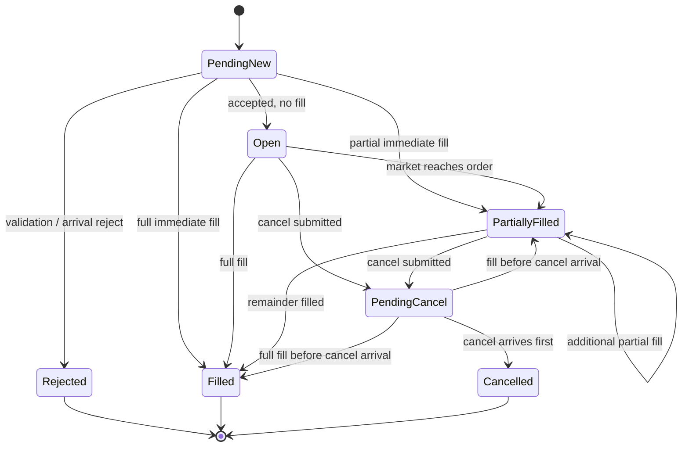

# Orders, matching, private liquidity, and state

## 1. Supported order surface

The first version supports:

- limit orders only;
- Good-Till-Cancel behavior;
- positive integer quantity;
- generated numeric client order IDs;
- cancel by client order ID;
- one instrument per order;
- partial fills.

Unsupported types are rejected with a typed reason rather than silently approximated.

## 2. Single fill authority

Only `SimulatedLOB` decides whether a synthetic fill occurs. `OrderManager` owns lifecycle transitions but does not independently match. The scheduler decides when an order arrives but not whether it fills.

In the implementation, typed `EngineView` owns private resting indexes and
historical-consumption revisions. `SimulatedLOB` returns typed
`SyntheticFill` decisions. `TradingEngine` neither scans historical liquidity
nor decides fill price/quantity; it only applies those decisions in order.

## 3. Immediate matching algorithm

### Buy

A buy is marketable while the best privately visible historical ask satisfies:

```text
ask_price <= buy_limit_price
```

### Sell

A sell is marketable while the best privately visible historical bid satisfies:

```text
bid_price >= sell_limit_price
```

### Fill loop

```text
remaining = requested_quantity
for each opposite historical level from best to worse:
    stop if level price is outside the limit
    available = historical_level_quantity - private_consumed_quantity
    fill_qty = min(remaining, available)
    emit fill at historical level price
    add fill_qty to private consumption for that historical level revision
    remaining -= fill_qty
    stop if remaining == 0
if remaining > 0:
    insert the remainder as an own resting order
```

This sweep is required even though the source says “start with fill-at-touch”: stopping after one level can leave a marketable remainder crossed against the next visible level.

## 4. Resting-order reevaluation

After every atomic historical book update for an instrument:

1. identify own resting buys that are at or above the private historical best ask;
2. identify own resting sells that are at or below the private historical best bid;
3. process own orders by price priority, then exchange-arrival sequence FIFO;
4. fill against privately available historical depth;
5. update or remove resting quantities;
6. emit fills to OrderManager before market callbacks.

Do not scan every order in the system if price-indexed maps can identify only marketable ranges.

## 5. Private consumption and historical revisions

Synthetic fills do not mutate the shared historical replay. An EngineView records only its private depletion.

Consumption must not be keyed by price alone. Use a key equivalent to:

```text
instrument_id + historical_side + price_ticks + level_revision
```

The historical book increments a level revision whenever the historical content at that side/price changes in a way that invalidates previous availability. When old liquidity disappears and new liquidity appears at the same price, the new revision is not reduced by stale private consumption.

A stronger per-historical-order-ID model is acceptable if it remains simple and efficient.

## 6. Own-order FIFO

Own resting orders at one price are ordered by `arrival_seq`, not by string ID or hash iteration. This ordering must remain stable under cancel and partial fill.

Own buy and sell orders must never match each other in HW4. Matching is only against the historical opposite side. If own orders cross each other, they remain private overlays unless the team explicitly adds self-match prevention/rejection as a documented decision.

## 7. Validation and rejects

Reject at submission or arrival with a typed reason for at least:

- unknown instrument;
- side `None`;
- non-positive quantity;
- invalid/non-positive price;
- price not aligned to instrument tick size;
- duplicate client order ID if an externally supplied ID path exists;
- unsupported order type or time-in-force;
- cancel of unknown or already terminal order.

The exact boundary between local and arrival validation is less important than deterministic state and callback behavior.

## 8. Order state machine



## 9. Transition rules

- `open_orders(instrument_id)` includes `PendingNew`, `Open`, `PartiallyFilled`, and `PendingCancel` orders with positive remaining quantity.
- A full fill is terminal and removes the order from open-order indexes before `on_fill()`.
- Position and filled quantity are updated before `on_fill()`.
- Cancel submission changes eligible states to `PendingCancel` immediately.
- If fills occur before cancel arrival, they are applied normally.
- A cancel arrival after a full fill is recorded as a cancel reject or no-op according to one documented rule; the recommended rule is a typed reject for observability.
- Every externally visible transition creates one order-log row.

## 10. Position semantics

Use signed quantity per instrument:

- buy fill adds quantity;
- sell fill subtracts quantity.

Track at least:

- net quantity;
- average open price or a consistent realized-PnL accounting basis;
- realized PnL;
- last mark used for unrealized PnL.

Contract multiplier comes from `InstrumentMeta` and is applied to PnL, not to raw position quantity.
