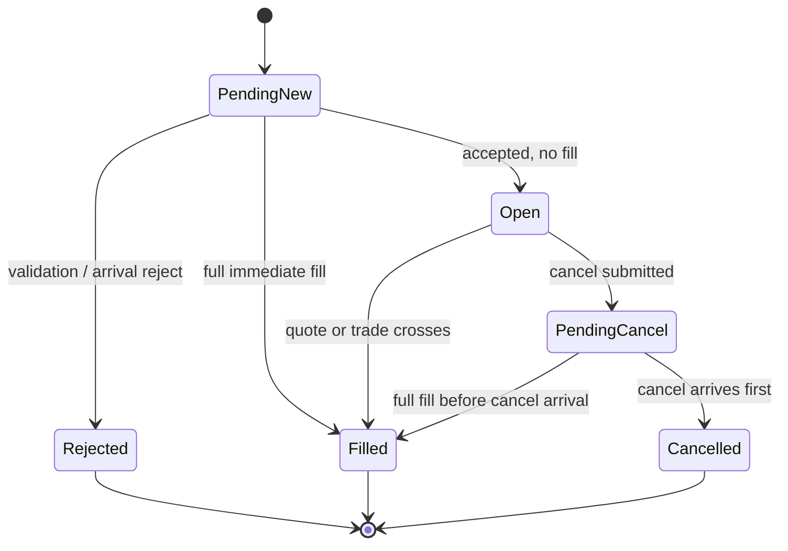

# Orders, matching, private liquidity, and state

## 1. Supported order surface

The runtime supports:

- limit orders only;
- Good-Till-Cancel behavior;
- positive integer quantity;
- generated numeric client order IDs;
- cancel by client order ID;
- one instrument per order;
- one full fill when the first eligible price-cross signal arrives.

Unsupported types are rejected with a typed reason rather than silently
approximated.

## 2. Single fill authority

Only `SimulatedLOB` decides whether a synthetic fill occurs. `OrderManager` owns lifecycle transitions but does not independently match. The scheduler decides when an order arrives but not whether it fills.

In the implementation, typed `EngineView` owns private resting indexes.
`SimulatedLOB` consumes typed `PriceCrossSignal` values and returns typed
`SyntheticFill` decisions. `TradingEngine` neither applies crossing predicates
nor decides fill price/quantity; it only applies those decisions in order.

## 3. Price-cross matching algorithm

### Buy

A buy is eligible when either:

```text
best_ask <= buy_limit_price
trade_price <= buy_limit_price
```

### Sell

A sell is eligible when either:

```text
best_bid >= sell_limit_price
trade_price >= sell_limit_price
```

Trade aggressor side is intentionally ignored. A signal can match only an order
with the same `instrument_id`; movement in an underlying or another option
series cannot fill the order.

### Fill decision

```text
for each raw price-cross signal in source-sequence order:
    select own orders for the signal instrument in price-time order
    for every eligible own order:
        fill_price = best opposite quote or trade price
        fill_qty = complete remaining_quantity
        emit exactly one fill with QuoteCross or TradeCross source
        remove the order from the resting index
```

Historical quote size and trade size are ignored. One small signal can therefore
fill multiple oversized own orders. This deliberate infinite-liquidity model is
optimistic and does not claim historical executability for the submitted size.

## 4. Order arrival and resting reevaluation

An order becomes eligible only after its delayed new-order arrival. At arrival:

1. evaluate the current best opposite quote;
2. fill the complete quantity at that quote if crossed;
3. otherwise insert the order into the private price-time resting index.

Past trades are never replayed for a later order. After arrival, every raw
quote/trade signal is evaluated in source order. Price-indexed maps stop the
scan at the first non-crossed own order.

## 5. Raw-signal chronology

The dispatcher applies every raw row in an atomic source group and records a
typed signal immediately after that row:

- a book action records the resulting best bid and ask;
- a trade records its trade price.

The signal span is passed with the final stable book/trade delivery. It is
replayed before public trade and final-book callbacks. Thus “first” is exact
within a group without exposing inconsistent intermediate books to Python.
Every synthetic fill retains the winning raw sequence as
`trigger_source_sequence`; the independent `sequence` field remains the
monotonic synthetic fill sequence. An arrival-time quote fill uses the latest
book-action source sequence retained by the historical book.

`LiquiditySource::HistoricalDisplayed = 0` is retained for result compatibility.
New runtime fills use `QuoteCross = 1` or `TradeCross = 2`.

## 6. Own-order FIFO

Own resting orders at one price are ordered by `arrival_seq`, then numeric
client order ID. A signal fills every eligible order in deterministic own
price-time order.

Own buy and sell orders must never match each other in HW4. Matching is only against the historical opposite side. If own orders cross each other, they remain private overlays unless the team explicitly adds self-match prevention/rejection as a documented decision.

## 7. Validation and rejects

Reject at submission or arrival with a typed reason for at least:

- unknown instrument;
- side `None`;
- non-positive quantity;
- invalid/non-positive price;
- price not aligned to instrument tick size;
- duplicate client order ID if an externally supplied ID path exists;
- unsupported order type or time-in-force;
- cancel of unknown or already terminal order.

The exact boundary between local and arrival validation is less important than deterministic state and callback behavior.

## 8. Order state machine



## 9. Transition rules

- `open_orders(instrument_id)` includes `PendingNew`, `Open`, and
  `PendingCancel` orders with positive remaining quantity.
- `PartiallyFilled` remains in the public enum for compatibility but is not
  produced by the full-fill-on-cross matcher.
- A full fill is terminal and removes the order from open-order indexes before `on_fill()`.
- Position and filled quantity are updated before `on_fill()`.
- Cancel submission changes eligible states to `PendingCancel` immediately.
- If fills occur before cancel arrival, they are applied normally.
- A cancel arrival after a full fill emits
  `RejectReason::AlreadyTerminal`.
- Every externally visible transition creates one order-log row.

## 10. Position semantics

Use signed quantity per instrument:

- buy fill adds quantity;
- sell fill subtracts quantity.

Track at least:

- net quantity;
- average open price or a consistent realized-PnL accounting basis;
- realized PnL;
- last mark used for unrealized PnL.

Contract multiplier comes from `InstrumentMeta` and is applied to PnL, not to raw position quantity.
