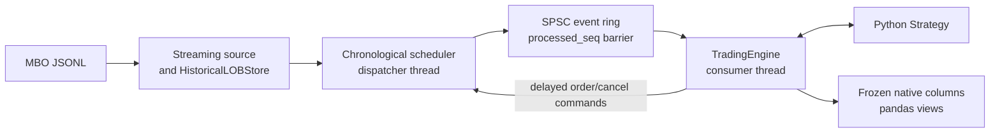

# Architecture documentation

This directory describes the implemented Homework 4 backtesting engine. It is
the entry point for understanding the system before reading the C++ or Python
code.

The engine replays Databento-like MBO JSONL data into a historical level-3
order book, schedules market data and strategy commands on one deterministic
virtual timeline, simulates private strategy orders, invokes Python callbacks,
and returns bulk pandas-compatible results.

## Architecture at a glance

The mandatory runtime uses one process and two native worker threads. The
dispatcher is the only writer of the shared historical book. The trading
thread owns private orders, positions, matching state, and result writes.
`processed_seq` prevents the dispatcher from changing the book while the
trading thread is reacting to the current delivery.

## Reading guide

1. [`01_scope_and_decisions.md`](01_scope_and_decisions.md) — implemented
   behavior, supported features, and explicit limitations.
2. [`02_context_and_containers.md`](02_context_and_containers.md) — runtime
   topology, ownership, and complete market/order flows.
3. [`03_components_and_boundaries.md`](03_components_and_boundaries.md) —
   canonical component interaction diagram, source tree, module
   responsibilities, target graph, and dependencies.
4. [`04_event_time_and_concurrency.md`](04_event_time_and_concurrency.md) —
   virtual time, stable ordering, queues, ready barrier, and shutdown.
5. [`05_order_matching_and_state.md`](05_order_matching_and_state.md) —
   full-fill-on-price-cross matching, order lifecycle, and positions.
6. [`06_python_api_and_results.md`](06_python_api_and_results.md) — pybind11
   boundary, Strategy API, GIL rules, result schemas, and ownership.
7. [`07_performance.md`](07_performance.md) — hot-path design and the two
   reproducible benchmarks.
8. [`08_implementation_map.md`](08_implementation_map.md) —
   implementation map from architecture concepts to source files and tests.
9. [`09_testing_and_acceptance.md`](09_testing_and_acceptance.md) — test
   layers, exact commands, and acceptance coverage.
10. [`10_shared_contracts.md`](10_shared_contracts.md) — native types,
    encodings, payload lifetimes, and public result contracts.
11. [`11_requirements_traceability.md`](11_requirements_traceability.md)
    — traceability from the assignment text and original big-picture diagram
    to implemented code and verification.

## Sources and authority

- The normalized assignment is
  [`../source/01_homework_4_assignment.md`](../source/01_homework_4_assignment.md).
- The original big-picture diagram is
  [`../source/02_original_big_picture_mermaid.md`](../source/02_original_big_picture_mermaid.md).
- These architecture documents explain the behavior implemented by the current
  code and locked by the current tests.
- If documentation and executable behavior diverge, treat it as a defect:
  update the implementation and tests or correct the documentation in the same
  change.
