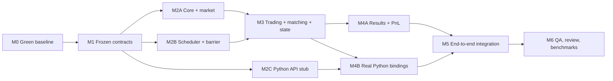

# Execution plan, milestones, and dependency graph

## 0. Integration branch

Homework 4 is developed on `hw4/backtest-engine-options`, created from the
reviewed `main` baseline `c4f4c02916f5a9fb5f2636926fd93cd28af0f46d`.
Short-lived milestone branches/worktrees merge into this integration branch
after their QA/review gates pass. `main` is not the active HW4 development
branch.

## 1. Critical path

## 2. Milestone M0 — reproducible green baseline

Owner prompt: `prompts/01_dev_baseline_packaging.md`.

Deliverables:

- clean native configure/build/test without missing untracked Catch2 files;
- hard-coded Windows path removed; CLI accepts a path or shows usage;
- UV selected; stale PDM settings removed;
- `scikit-build-core` package skeleton;
- minimal importable pybind11 module;
- tiny checked-in JSONL fixture;
- CI/documented commands reflect the actual build.

Exit gate: independent QA can clone/build/test from a clean worktree.

## 3. Milestone M1 — shared contracts frozen

Team Lead owns coordination; core developer implements.

Deliverables:

- fixed-width types and enums;
- event/order/fill/reject/view structs;
- `BacktestConfig`, `InstrumentMeta`, result schemas;
- callback and order API note committed;
- adapters for old types where needed;
- contract tests or compile-time assertions.

Exit gate: Python stub and native subsystems compile against the same header without local copies of the contract.

## 4. Milestone M2 — parallel foundations

### M2A Core and market

Owner prompt: `prompts/02_dev_core_market.md`.

- typed ingestion;
- streaming reader/source iterator;
- HistoricalLOBStore;
- top-N and revisions;
- L3 correctness tests.

### M2B Scheduler and synchronization

Owner prompt: `prompts/03_dev_scheduler_concurrency.md`.

- SPSC rings;
- scheduled ordering;
- ready barrier;
- lifecycle/stop handling;
- native scripted-consumer tests.

### M2C Python Strategy stub

Owner prompt: `prompts/05_dev_python_api.md`.

- Strategy trampoline and payload bindings against a stub context;
- GIL behavior tests;
- no final engine integration yet.

Safe parallelism requires M1 to be merged first and file ownership to be non-overlapping.

## 5. Milestone M3 — trading engine behavior

Owner prompt: `prompts/04_dev_trading_matching.md`.

Deliverables:

- MarketDataConsumer and virtual clock;
- refactored EngineView/SimulatedLOB;
- multi-level fill-at-touch;
- resting-order reevaluation;
- OrderManager state machine;
- PositionKeeper;
- cancel arrival behavior;
- native integration tests.

Exit gate: a C++ scripted Strategy can submit, rest, fill later, cancel, and query position deterministically.

## 6. Milestone M4 — results and real bindings

### M4A Results/PnL

Owner prompt: `prompts/06_dev_results_pnl.md`.

- columnar native buffers;
- order/fill/PnL recording;
- multiplier-aware PnL;
- lifetime tests.

### M4B Python integration

Owner prompt: `prompts/05_dev_python_api.md` with a new integration task brief.

- replace stub context with real OrderManager/TradingEngine;
- expose `backtest.run()`;
- bulk Result conversion;
- callback exception handling end-to-end.

## 7. Milestone M5 — end-to-end checkpoint

Owner prompt: `prompts/07_dev_integration_benchmarks.md`.

- checked-in Python mean-reversion strategy;
- deterministic JSONL fixture;
- exact expected callbacks/orders/fills/positions/PnL;
- one documented run command;
- no stub remains on the production path.

## 8. Milestone M6 — hardening and submission

- ready-signal benchmark;
- Python callback benchmark;
- clean Release run;
- sanitizer run where available;
- independent QA report;
- independent architecture/performance review;
- fixes for all P0/P1 findings;
- final README and limitations.

## 9. Parallelization rules

Parallelize only tasks with disjoint owned files and frozen interfaces. Never let two agents independently change:

- public type headers;
- pyproject/CMake target names;
- order states;
- callback payloads;
- result schemas.

When a shared contract must change, pause dependent tasks, merge the contract change, then rebase/restart them.
