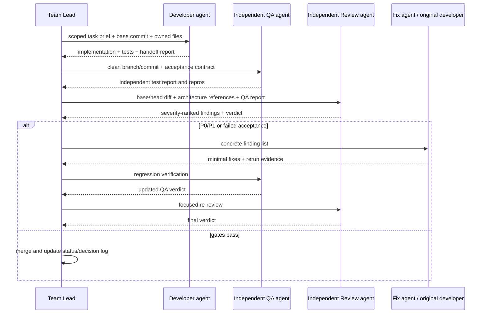

# Agent workflow and quality gates

## 1. Required flow per task

## 2. Branch/worktree policy

- One task = one short-lived branch/worktree.
- Suggested name: `agent/<issue-id>-<slug>`.
- Never run two coding agents in the same working tree.
- Rebase or merge current `main` before final QA.
- Do not keep long-lived “Group A” and “Group B” branches.
- Keep PRs small enough to review in one sitting; split mechanical moves from behavior changes when useful.

## 3. Developer gate

Before handoff, the developer must:

- run formatting/lint on changed files;
- build from a clean or freshly configured directory;
- run all relevant unit/integration tests;
- add tests for every new branch of behavior;
- report exact commands and outcomes;
- document deviations from architecture;
- leave no known crash, deadlock, data race, or silent data corruption.

## 4. QA gate

QA must be independent of the implementation agent and must:

- use a clean worktree at the exact candidate commit;
- reproduce the developer's happy path;
- add/run adversarial cases not copied from developer tests;
- verify deterministic repeatability;
- verify build/package instructions;
- classify failures as P0/P1/P2/P3;
- avoid “fixing while testing” unless separately assigned.

## 5. Review gate

Reviewer must inspect the diff against its base, not only run tests. Review covers:

- assignment and architecture compliance;
- state/ordering correctness;
- concurrency and memory ordering;
- GIL and object lifetime;
- performance hazards;
- API clarity and backward compatibility;
- error paths and shutdown;
- test quality and missing cases;
- unrelated changes.

No unresolved P0/P1 finding may merge.

## 6. Severity definitions

- **P0 Blocker:** build cannot start, deadlock, crash, data corruption, look-ahead/causality failure, or fundamentally wrong fills/results.
- **P1 Major:** required behavior missing, nondeterminism, incorrect state/PnL, unsafe lifetime, major performance violation in hot path.
- **P2 Moderate:** incomplete validation, weak test coverage, avoidable allocation, confusing API, non-critical edge case.
- **P3 Minor:** style, naming, documentation, small maintainability issue.

## 7. Merge gate checklist

- [ ] Candidate commit and base commit recorded.
- [ ] Clean native build passes.
- [ ] Editable Python install/import passes when relevant.
- [ ] Unit/integration tests pass.
- [ ] Independent QA verdict is PASS or PASS WITH P2/P3.
- [ ] Independent reviewer verdict is APPROVE or APPROVE WITH P2/P3.
- [ ] P0/P1 findings are closed and verified.
- [ ] Decision log updated for contract/architecture changes.
- [ ] Status board and next dependencies updated.
