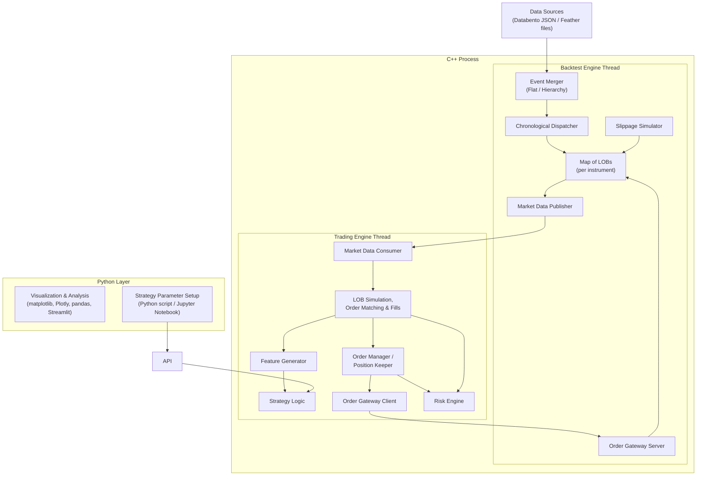
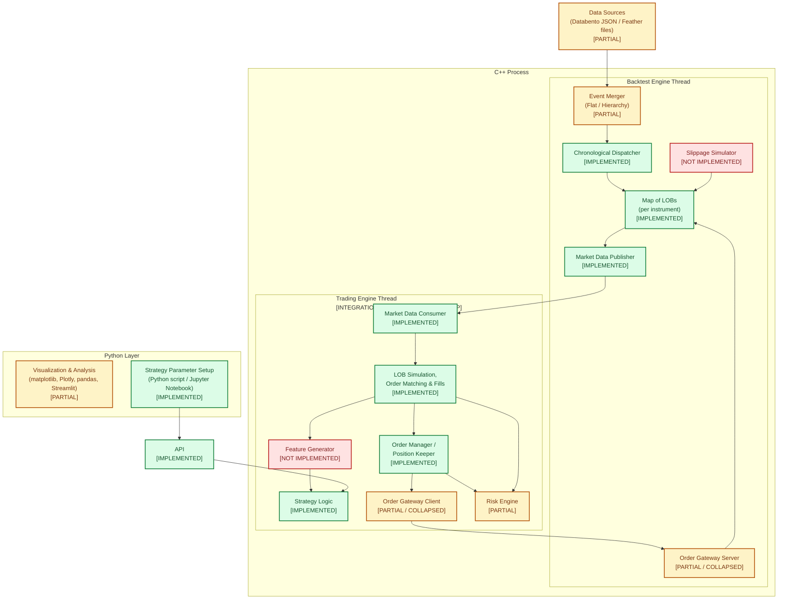

# Screenshot module implementation and code traceability

## Audit scope

This document answers two questions about the modules in the original
architecture screenshot:

1. which modules are implemented by the current HW4 PR;
2. which modules are still absent or only partially represented.

The audit compares:

- reviewed baseline:
  `c4f4c02916f5a9fb5f2636926fd93cd28af0f46d`;
- implementation base:
  `06e29a3e5fd5617675d3e8df54b627c58547a833`;
- source diagram:
  [`02_original_big_picture_mermaid.md`](../source/02_original_big_picture_mermaid.md);
- adopted scope:
  [`01_scope_and_decisions.md`](../architecture/01_scope_and_decisions.md);
- implementation and tests in the current patch.

The screenshot is broader than the mandatory HW4 assignment. Therefore,
“not implemented” below does not automatically mean that the PR is incomplete:
some boxes are explicitly outside the adopted scope.

The Backtest Engine Options work is the owned delivery scope. Trading Engine
Thread components are retained in this trace because they are the integration
boundary needed to execute and test the backtest path end to end; they remain
owned by the Trading Engine team.

## Status definitions

| Status | Meaning |
|---|---|
| **Implemented** | The screenshot capability is present in the production runtime for the adopted HW4 scope and has executable test evidence. |
| **Partial / collapsed** | Some behavior exists, but the screenshot's complete standalone module does not. It may be intentionally collapsed into the in-process runtime. |
| **Not implemented** | No production runtime implementation of that screenshot capability was found. |

## Original diagram

This is the Mermaid diagram copied as-is from
[`02_original_big_picture_mermaid.md`](../source/02_original_big_picture_mermaid.md):

## Diagram with implementation tags

The topology below is unchanged. Tags and colors reflect the code audit:

- green — `IMPLEMENTED`;
- amber — `PARTIAL / COLLAPSED`;
- red — `NOT IMPLEMENTED`.

## Short answer

### Implemented in the PR

- Databento-like JSONL ingestion;
- Event Merger for one prefetched market stream plus delayed order commands;
- Chronological Dispatcher;
- Map of LOBs per instrument;
- Market Data Publisher and Market Data Consumer as the two ends of an SPSC
  event channel;
- LOB Simulation, Order Matching & Fills;
- Order Manager;
- Position Keeper;
- Python Strategy Logic and callback API;
- Strategy Parameter Setup through Python objects/scripts;
- the Python API and pandas result-return path.

The Trading Engine items in this list describe integration code and executable
coverage present in the branch, not a transfer of module ownership.

### Partial or collapsed in the PR

- Data Sources: JSONL is supported, but Feather replay is not;
- Event Merger: the HW4 market-plus-command merge is implemented, but there is
  no generic flat/hierarchical multi-feed merger;
- Order Gateway Client / Server: order transport and delayed arrival semantics
  exist, but they are collapsed into an in-process command ring and scheduler;
- Risk Engine: deterministic order and instrument validation exists, but a full
  options risk engine does not;
- Visualization & Analysis: pandas data is returned, but no built-in
  matplotlib, Plotly, Streamlit, or notebook application is supplied.

### Still not implemented

- Feather as a runtime replay source;
- standalone Slippage Simulator;
- standalone/native Feature Generator;
- standalone or networked Order Gateway Client / Server;
- full Risk Engine;
- built-in visualization/dashboard application.

Advanced options functions such as Greeks, a volatility surface, exercise,
assignment, expiry settlement, and multi-leg execution are also not
implemented, although they are not separate boxes in the screenshot.

## Code traceability matrix

| Screenshot module | Status | Production-code evidence | Executable evidence | What is actually implemented / missing |
|---|---|---|---|---|
| **Data Sources — Databento JSON** | **Implemented** | [`JsonlReader.hpp:L30-L55`](../../../src/market/JsonlReader.hpp#L30-L55), [`JsonlReader.cpp:L227-L311`](../../../src/market/JsonlReader.cpp#L227-L311), [`BacktestRuntime.cpp:L42-L115`](../../../src/runtime/BacktestRuntime.cpp#L42-L115) | [`CoreMarketTest.cpp:L139-L168`](../../../test/CoreMarketTest.cpp#L139-L168), [`RuntimeTest.cpp:L50-L77`](../../../test/RuntimeTest.cpp#L50-L77) | Streams Databento-like MBO JSONL, parses timestamps/prices once, preserves source order, and stages complete atomic groups. |
| **Data Sources — Feather files** | **Implemented for Python replay** | [`_input.py`](../../../python/back_tester/_input.py) validates Feather V2 columns and [`bindings.cpp`](../../../src/python/bindings.cpp) converts them once to native events consumed by the shared runtime source in [`BacktestRuntime.cpp`](../../../src/runtime/BacktestRuntime.cpp). | JSONL/Feather parity, validation, and converter coverage are in [`test_feather.py`](../../../python/tests/test_feather.py). | `backtest.run()` accepts converter-produced Feather files. The pure C++ CLI remains JSONL-only. |
| **Event Merger (Flat / Hierarchy)** | **Implemented for HW4 scope; otherwise partial** | The runtime keeps one prefetched source event and merges it with queued commands in [`SchedulerRuntime.hpp:L179-L220`](../../../src/scheduler/SchedulerRuntime.hpp#L179-L220), [`SchedulerRuntime.hpp:L237-L262`](../../../src/scheduler/SchedulerRuntime.hpp#L237-L262), and [`SchedulerRuntime.hpp:L285-L298`](../../../src/scheduler/SchedulerRuntime.hpp#L285-L298). | [`SchedulerTest.cpp:L253-L278`](../../../test/SchedulerTest.cpp#L253-L278), [`SchedulerTest.cpp:L280-L310`](../../../test/SchedulerTest.cpp#L280-L310) | Deterministically merges the historical market stream with new-order/cancel arrivals. It is not a generic N-feed flat/hierarchical merger. |
| **Chronological Dispatcher** | **Implemented** | Heap insertion/removal is in [`ChronologicalScheduler.cpp:L8-L45`](../../../src/scheduler/ChronologicalScheduler.cpp#L8-L45); dispatch, stable sequencing, and backward-time rejection are in [`SchedulerRuntime.hpp:L179-L220`](../../../src/scheduler/SchedulerRuntime.hpp#L179-L220). | [`SchedulerTest.cpp:L230-L251`](../../../test/SchedulerTest.cpp#L230-L251), [`SchedulerTest.cpp:L312-L335`](../../../test/SchedulerTest.cpp#L312-L335) | Orders events by `(scheduled timestamp, priority, stable sequence)`, with market data winning equal-time ties. |
| **Map of LOBs (per instrument)** | **Implemented** | [`HistoricalLOBStore.cpp:L7-L35`](../../../src/market/HistoricalLOBStore.cpp#L7-L35) creates and looks up one historical L3 book per `instrument_id`; the runtime owns the store starting at [`BacktestRuntime.cpp:L311`](../../../src/runtime/BacktestRuntime.cpp#L311). | [`CoreMarketTest.cpp:L495-L510`](../../../test/CoreMarketTest.cpp#L495-L510), two-instrument E2E test [`test_end_to_end.py`](../../../python/tests/test_end_to_end.py) | Independent historical books are routed by numeric instrument ID. |
| **Market Data Publisher** | **Implemented as an in-process transport role** | The dispatcher publishes `ScheduledEvent` values into `event_ring_` in [`SchedulerRuntime.hpp:L191-L214`](../../../src/scheduler/SchedulerRuntime.hpp#L191-L214); the ring and ownership are declared in [`SchedulerRuntime.hpp:L308-L312`](../../../src/scheduler/SchedulerRuntime.hpp#L308-L312). | SPSC transport tests [`SchedulerTest.cpp:L141-L183`](../../../test/SchedulerTest.cpp#L141-L183); acknowledgement gating test [`SchedulerTest.cpp:L376-L407`](../../../test/SchedulerTest.cpp#L376-L407). | There is no separately named publisher class or network publisher. The dispatcher-side SPSC producer is the publisher boundary. |
| **Market Data Consumer** | **Implemented as an in-process transport role** | The trading thread consumes the event ring and invokes the engine in [`SchedulerRuntime.hpp:L157-L177`](../../../src/scheduler/SchedulerRuntime.hpp#L157-L177). `TradingEngine` advances virtual time and dispatches payloads immediately before [`TradingEngine.cpp:L220`](../../../src/trading/TradingEngine.cpp#L220). | [`RuntimeTest.cpp:L50-L77`](../../../test/RuntimeTest.cpp#L50-L77), callback contract test [`test_runtime.py:L65`](../../../python/tests/test_runtime.py#L65). | Receives market deliveries, advances the virtual clock, processes callbacks, and acknowledges the sequence after processing. |
| **Market Data Publisher → Consumer ready barrier** | **Implemented** | Release/acquire publication is in [`ReadyBarrier.hpp:L10-L43`](../../../src/scheduler/ReadyBarrier.hpp#L10-L43); consumer acknowledgement is published in [`SchedulerRuntime.hpp:L157-L171`](../../../src/scheduler/SchedulerRuntime.hpp#L157-L171), and the dispatcher waits in [`SchedulerRuntime.hpp:L264-L283`](../../../src/scheduler/SchedulerRuntime.hpp#L264-L283). | [`SchedulerTest.cpp:L213-L227`](../../../test/SchedulerTest.cpp#L213-L227), [`SchedulerTest.cpp:L376-L407`](../../../test/SchedulerTest.cpp#L376-L407). | Uses the required atomic `processed_seq`; it is not encoded as a queue message. |
| **LOB Simulation, Order Matching & Fills** | **Implemented for integration; Trading Engine team ownership** | `EngineView` owns private resting orders in [`SimulatedLOB.hpp:L27`](../../../src/trading/SimulatedLOB.hpp#L27). `SimulatedLOB` tests the current quote on acceptance and consumes ordered quote/trade signals in [`SimulatedLOB.cpp:L34`](../../../src/trading/SimulatedLOB.cpp#L34) and [`SimulatedLOB.cpp:L66`](../../../src/trading/SimulatedLOB.cpp#L66). The runtime materializes raw-signal chronology in [`BacktestRuntime.cpp:L135`](../../../src/runtime/BacktestRuntime.cpp#L135), and `TradingEngine` replays it before public market callbacks in [`TradingEngine.cpp:L220`](../../../src/trading/TradingEngine.cpp#L220). | Full-fill quote/trade behavior and causality are covered by [`TradingTest.cpp:L132`](../../../test/TradingTest.cpp#L132), [`TradingTest.cpp:L187`](../../../test/TradingTest.cpp#L187), and [`TypedSimulatedLOBTest.cpp:L24`](../../../test/TypedSimulatedLOBTest.cpp#L24). Python integration is covered by [`test_runtime.py:L156`](../../../python/tests/test_runtime.py#L156). | `SimulatedLOB` remains the sole synthetic-fill authority. The first same-instrument quote or trade price that crosses a resting limit fills its complete remaining quantity at the trigger price; historical quote/trade volume is intentionally ignored. |
| **Order Manager** | **Implemented inside `TradingEngine`** | Submission and `PendingNew` state start at [`TradingEngine.cpp:L102`](../../../src/trading/TradingEngine.cpp#L102); cancel state starts at [`TradingEngine.cpp:L134`](../../../src/trading/TradingEngine.cpp#L134); accepted/cancelled transitions start at [`TradingEngine.cpp:L250`](../../../src/trading/TradingEngine.cpp#L250); fill transitions and open-index removal start at [`TradingEngine.cpp:L309`](../../../src/trading/TradingEngine.cpp#L309). | Lifecycle assertions are in [`test_end_to_end.py`](../../../python/tests/test_end_to_end.py), with cancel behavior in [`TradingTest.cpp`](../../../test/TradingTest.cpp). | There is no separate `OrderManager` class, but its complete mandatory lifecycle and open-order-index responsibilities are implemented by `TradingEngine`. |
| **Position Keeper** | **Implemented as a dedicated component** | Instrument registration and fill accounting are in [`PositionKeeper.cpp:L36-L104`](../../../src/trading/PositionKeeper.cpp#L36-L104); query exposure begins at [`PositionKeeper.cpp:L105`](../../../src/trading/PositionKeeper.cpp#L105). `TradingEngine` updates it before the callback at [`TradingEngine.cpp:L321`](../../../src/trading/TradingEngine.cpp#L321). | FIFO and multiplier tests are in [`TradingTest.cpp`](../../../test/TradingTest.cpp); E2E position assertions are in [`test_end_to_end.py`](../../../python/tests/test_end_to_end.py). | Tracks per-instrument signed quantity and FIFO realized-PnL inputs. |
| **Order Gateway Client** | **Partial / collapsed** | Python/native strategy submission enters `TradingEngine` through [`bindings.cpp:L43-L65`](../../../src/python/bindings.cpp#L43-L65). It emits delayed `NewOrderCommand` / `CancelCommand` values in [`TradingEngine.cpp:L124-L130`](../../../src/trading/TradingEngine.cpp#L124-L130) and [`TradingEngine.cpp:L157-L165`](../../../src/trading/TradingEngine.cpp#L157-L165). | Delayed-order E2E behavior [`RuntimeTest.cpp:L50-L77`](../../../test/RuntimeTest.cpp#L50-L77). | Client-side command semantics exist, but there is no standalone gateway client, socket, protocol, or IPC. |
| **Order Gateway Server** | **Partial / collapsed** | The dispatcher drains the command ring into the chronological scheduler in [`SchedulerRuntime.hpp:L264-L298`](../../../src/scheduler/SchedulerRuntime.hpp#L264-L298); command arrival is handled starting at [`TradingEngine.cpp:L250`](../../../src/trading/TradingEngine.cpp#L250). | Market/command merge test [`SchedulerTest.cpp:L253-L278`](../../../test/SchedulerTest.cpp#L253-L278); delayed fill test [`TradingTest.cpp:L132`](../../../test/TradingTest.cpp#L132). | Server-side arrival semantics exist in process, but no standalone gateway server or network boundary exists. |
| **Slippage Simulator** | **Not implemented** | No production slippage component is present. Matching fills at the qualifying quote/trade trigger price in [`SimulatedLOB.cpp`](../../../src/trading/SimulatedLOB.cpp). Fixed order latency is scheduling, not price slippage. | Matching tests assert trigger-price fills in [`TradingTest.cpp`](../../../test/TradingTest.cpp). | No configurable price/impact/slippage model. This is explicitly outside the adopted HW4 scope. |
| **Feature Generator** | **Not implemented as a module** | The native callback contract exposes book/trade/fill/reject data in [`Strategy.hpp:L30-L40`](../../../src/trading/Strategy.hpp#L30-L40), but no production `FeatureGenerator` exists. | The example computes decisions directly in strategy callbacks: [`mean_reversion.py:L11-L49`](../../../examples/mean_reversion.py#L11-L49). | Strategies may compute their own features, but there is no reusable native or Python feature-generation framework. |
| **Strategy Logic** | **Implemented in Python through pybind11** | The adapter forwards all four callbacks while acquiring the GIL in [`bindings.cpp:L127-L167`](../../../src/python/bindings.cpp#L127-L167); the public Strategy methods and query/command API are bound in [`bindings.cpp:L372-L386`](../../../src/python/bindings.cpp#L372-L386). | Python callback/command tests [`test_runtime.py:L156-L230`](../../../python/tests/test_runtime.py#L156-L230); production-path example [`mean_reversion.py:L11-L64`](../../../examples/mean_reversion.py#L11-L64). | The logic is Python-defined, even though the callback executes on the native trading thread. This resolves the mismatch in the original screenshot. |
| **Risk Engine** | **Partial validation only** | `TradingEngine::validate_order()` checks instrument, side, quantity, price, and tick alignment at [`TradingEngine.cpp:L74`](../../../src/trading/TradingEngine.cpp#L74). Runtime metadata validation starts at [`BacktestRuntime.cpp:L256`](../../../src/runtime/BacktestRuntime.cpp#L256). | Invalid-order tests and Python reject tests are in [`TradingTest.cpp`](../../../test/TradingTest.cpp) and [`test_runtime.py`](../../../python/tests/test_runtime.py). | No limits, margin, exposure aggregation, scenario risk, Greeks, volatility surface, or pre-trade options risk engine. |
| **Strategy Parameter Setup** | **Implemented for scripts; no special notebook integration** | `BacktestConfig`, `DateRange`, and `InstrumentMeta` are bound starting at [`bindings.cpp:L287`](../../../src/python/bindings.cpp#L287); `run()` starts at [`bindings.cpp:L398`](../../../src/python/bindings.cpp#L398). | Example configuration [`mean_reversion.py:L52-L64`](../../../examples/mean_reversion.py#L52-L64), with default/discovery tests in [`test_runtime.py`](../../../python/tests/test_runtime.py). | Python scripts can configure latency, depth, range, and instrument metadata. Jupyter can call the same API, but the PR does not ship a notebook-specific layer. |
| **API** | **Implemented** | `_backtester` is defined at [`bindings.cpp:L252`](../../../src/python/bindings.cpp#L252); `run()` is bound at [`bindings.cpp:L398`](../../../src/python/bindings.cpp#L398); `backtest.run` is exported in [`python/back_tester/__init__.py`](../../../python/back_tester/__init__.py). | Full Python runtime tests [`test_runtime.py`](../../../python/tests/test_runtime.py) and E2E tests [`test_end_to_end.py`](../../../python/tests/test_end_to_end.py). | Provides typed callbacks, order commands, state queries, configuration, and results. |
| **Visualization & Analysis** | **Partial boundary only** | Native result storage is frozen in [`ResultRecorder.cpp:L544-L554`](../../../src/results/ResultRecorder.cpp#L544-L554). Zero-copy-backed pandas DataFrames/Series are built in [`bindings.cpp:L173-L221`](../../../src/python/bindings.cpp#L173-L221). | Result schema/PnL assertions [`test_end_to_end.py:L66-L125`](../../../python/tests/test_end_to_end.py#L66-L125), buffer/dtype tests [`test_runtime.py:L602-L638`](../../../python/tests/test_runtime.py#L602-L638). | The PR provides analysis-ready pandas objects. It does not provide built-in matplotlib/Plotly charts, Streamlit UI, or a visualization application. |

## Runtime code trace

The implemented production path corresponding to the screenshot is:

1. `backtest.run()` crosses the pybind11 API boundary:
   [`bindings.cpp:L398`](../../../src/python/bindings.cpp#L398).
2. `run_backtest()` constructs the per-instrument books, recorder, trading
   engine, source, and scheduler:
   [`BacktestRuntime.cpp:L311`](../../../src/runtime/BacktestRuntime.cpp#L311).
3. `JsonlReader` streams and parses one typed market row:
   [`JsonlReader.cpp:L227-L300`](../../../src/market/JsonlReader.cpp#L227-L300).
4. `JsonlScheduledSource` groups rows and stages one market delivery:
   [`BacktestRuntime.cpp:L56-L116`](../../../src/runtime/BacktestRuntime.cpp#L56-L116).
5. `SchedulerRuntime` merges that delivery with delayed order commands:
   [`SchedulerRuntime.hpp:L179-L220`](../../../src/scheduler/SchedulerRuntime.hpp#L179-L220).
6. When the market event wins, the source updates `HistoricalLOBStore` and
   materializes exact-order price-cross signals, trades, and top-N depth:
   [`BacktestRuntime.cpp:L135`](../../../src/runtime/BacktestRuntime.cpp#L135).
7. The dispatcher publishes through the SPSC event ring, and the trading thread
   consumes it:
   [`SchedulerRuntime.hpp:L157-L214`](../../../src/scheduler/SchedulerRuntime.hpp#L157-L214).
8. `TradingEngine` replays each price-cross signal in source-sequence order
   before trade and book callbacks:
   [`TradingEngine.cpp:L220`](../../../src/trading/TradingEngine.cpp#L220).
9. `SimulatedLOB` applies the quote/trade crossing predicate and emits a full
   fill at the winning trigger price:
   [`SimulatedLOB.cpp:L66`](../../../src/trading/SimulatedLOB.cpp#L66).
10. `TradingEngine` updates order state and `PositionKeeper`, records the fill,
    and only then invokes `on_fill()`:
    [`TradingEngine.cpp:L309`](../../../src/trading/TradingEngine.cpp#L309).
11. After the complete reaction, the consumer publishes `processed_seq`, which
    permits the dispatcher to advance:
    [`SchedulerRuntime.hpp:L157-L171`](../../../src/scheduler/SchedulerRuntime.hpp#L157-L171).
12. At the end, native columns are frozen and returned as pandas objects:
    [`ResultRecorder.cpp:L544-L554`](../../../src/results/ResultRecorder.cpp#L544-L554),
    [`bindings.cpp:L173-L221`](../../../src/python/bindings.cpp#L173-L221).

## Important interpretation notes

### “Implemented” does not require one class per screenshot box

The screenshot is conceptual. In this PR:

- publisher and consumer are roles on opposite ends of `SpscRing`;
- gateway client/server behavior is the command ring plus scheduled arrival;
- Order Manager behavior is owned by `TradingEngine`;
- Strategy Logic is Python code invoked through the C++/pybind11 boundary.

This is consistent with the adopted one-process, two-thread HW4 architecture.
Creating sockets or standalone services only to mirror the screenshot would be
outside scope.

### The current matching model is price-cross/full-fill

For each instrument, the runtime preserves the order of raw quote and trade
signals inside an atomic group. The first post-arrival signal that crosses an
own limit fills the complete remaining quantity at that signal's price.
Displayed quote size and trade size do not cap execution. Multiple eligible own
orders are processed in deterministic own price-time order.
The callback and result row retain the winning raw row as
`trigger_source_sequence`, separately from the synthetic fill sequence.

This optimistic model deliberately delegates liquidity sizing to the strategy
author. The accepted requirement and its code/test mapping are documented in
[`01_price_cross_full_fill_traceability.md`](../proposals/01_price_cross_full_fill_traceability.md).

### Trading Engine ownership

The Trading Engine Thread was delivered by another team. Its modules stay in
the branch and in this matrix because the Backtest Engine output cannot be
validated in isolation: integration tests must prove signal ordering, order
arrival causality, fill callbacks, positions, and result rows. Keeping this code
and coverage is therefore appropriate; it should be labelled integration
scope, not claimed as newly owned Backtest Engine work.

### Options-specific boundary

The engine replays every option contract as an independent `instrument_id` and
uses `contract_multiplier` in position/PnL accounting. It does not infer option
fills from movement in the underlying instrument. Full option lifecycle and
risk analytics remain outside the present implementation.
