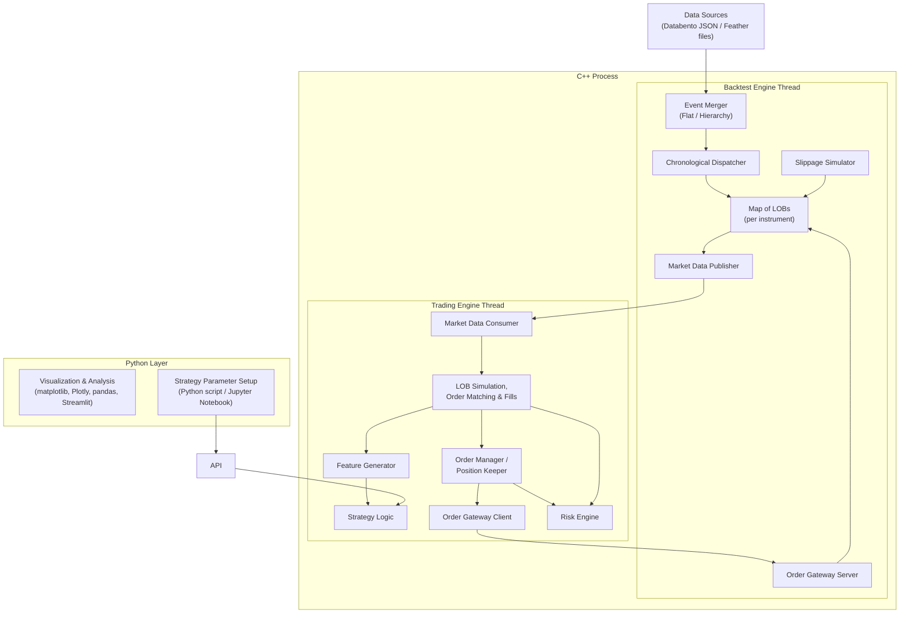

# Original assignment diagram — Mermaid transcription

> This diagram is a semantic transcription of the supplied “big picture” page. It preserves the boxes and intended flows, but Mermaid cannot reproduce the exact line routing of the source image. This is source material, not the adopted HW4 implementation design.

## Ambiguities visible in the source diagram

- It contains both trading-side “LOB Simulation, Order Matching & Fills” and backtest-side Gateway/Slippage components, so the authoritative fill producer is not explicit.
- The exact API return path to Python is not drawn.
- The diagram places “Strategy Logic” inside the C++ process, while Homework 4 requires a Python-defined strategy through pybind11.
- The Slippage Simulator and Order Gateway Server appear to modify the map of LOBs outside the Chronological Dispatcher, leaving same-timestamp ordering unspecified.

The adopted project resolution of these ambiguities is documented under [`../architecture`](../architecture/).
